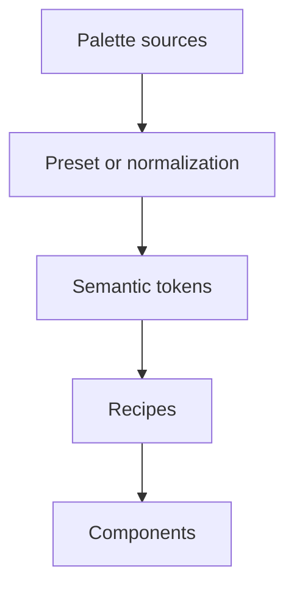

# Semantic Color Architecture - Revised Proposal

> **Status:** Draft for review  
> **Date:** 2026-06-30  
> **Author:** Design Systems Architect

## 1. What This Proposal Is Solving

The goal is a color architecture that can support hundreds of components, multiple brands, light and dark modes, and future expansion without creating a maze of public token layers.

The core principles are:

- Components should never know about primitive colors.
- Components should not depend on the theme package structure beyond the public semantic contract.
- Theme authors should configure semantic colors, not component internals.
- New palettes should not require component changes.
- New components should not require theme architecture changes.
- The public API should stay small and easy to reason about.

## 2. What Mature Systems Have in Common

Across Material 3, Fluent UI, Radix Themes, Chakra UI, Mantine, Panda CSS, Park UI, and Polaris, the pattern is broadly the same:

- Primitive color ramps exist, but they are not the main public API.
- A semantic layer describes intent such as background, text, border, surface, and status.
- Components consume semantic values, usually through recipes or component-local styles.
- The theming surface is small enough that app teams can adopt it without learning the whole implementation model.
- Special cases are usually solved locally in the component layer, not by adding a new global contract for every component type.

The systems differ in naming and exact depth, but they tend to avoid exposing too many shared layers to application authors.

## 3. Critique of the Original v2 Shape

The original v2 proposal introduced too many shared layers:

- Primitive colors
- Palette generators
- Semantic palette roles
- Global semantic tokens
- Component tokens
- Components

That structure is technically elegant, but it over-optimizes for theoretical extension points.

Main issues:

- The component-token layer duplicates what recipes already do.
- The public generator API creates a compatibility burden before it has proven value.
- The split between palette roles and global semantic tokens is too much for the public mental model.
- The folder structure mirrors implementation steps instead of responsibilities.
- The theme authoring API exposes too many knobs for the average user.

## 4. Revised Architecture

The revised architecture should be four layers, not six.

```text
Layer 1: Primitive palettes
         Raw color ramps. Internal input only.

Layer 2: Palette normalization
         Internal adapters that turn palette sources into normalized role maps.

Layer 3: Global semantic tokens
         Public design-system API. These are the values components and recipes use.

Layer 4: Components and recipes
         Component styling lives here. Local aliases are allowed, but not a shared component-token contract.
```

### Why this is simpler

- One public token layer instead of two.
- One component styling model instead of a global component-token graph.
- One place for theme authors to reason about color intent.
- One place for components to read from.

## 5. Primitive Palettes

Primitive palettes should exist, but they should stay behind the curtain.

They are useful because:

- They centralize raw ramps.
- They make brand palettes reusable.
- They allow internal normalization logic to map different palette shapes into the same semantic contract.

They should not be the public theme API.

### Recommendation

Avoid exposing a fixed public requirement like "every palette must be a 12-step scale". That assumption is too specific and will create unnecessary friction for non-Radix style palettes.

Instead:

- Accept palette sources in whatever shape the internal adapter understands.
- Normalize them internally into the system's semantic contract.

## 6. Palette Normalization

Palette normalization is useful, but it should remain an internal implementation detail for now.

It can map whatever ramp shape the theme uses into the same semantic roles.

### Do not make this a broad plugin API

A plugin system sounds flexible, but it adds:

- versioning complexity
- documentation burden
- support burden
- long-term compatibility risk

If a true ecosystem need appears later, it can be added later. For now, keep normalization internal.

## 7. Semantic Tokens

This should be the main public theming layer.

Semantic tokens describe intent, not implementation. They should answer questions like:

- What is the default page background?
- What color is body text?
- What color is the primary action?
- What color is used for borders?
- What colors represent success, warning, danger, and info?

### Suggested semantic token groups

```ts
export interface SemanticTokens {
  background: {
    default: string;
    subtle: string;
  };
  surface: {
    default: string;
    raised: string;
    overlay: string;
  };
  text: {
    primary: string;
    secondary: string;
    disabled: string;
    inverse: string;
  };
  border: {
    default: string;
    subtle: string;
    strong: string;
  };
  interactive: {
    primary: string;
    primaryHover: string;
    primaryFg: string;
    secondary: string;
    neutral: string;
  };
  status: {
    success: string;
    successBg: string;
    warning: string;
    warningBg: string;
    danger: string;
    dangerBg: string;
    info: string;
    infoBg: string;
  };
  focus: {
    ring: string;
  };
}
```

### Why this layer should stand alone

This layer is the right public boundary because it is stable, understandable, and broadly useful across components and brands.

It lets theme authors change palette choices without touching components.

### Why not merge it back into palette roles

You can merge them conceptually, but doing so makes theme authors think in terms of ramps instead of intent.

That creates more cognitive load than necessary and makes the public API feel closer to implementation than design.

## 8. Component Styling

Component-specific color behavior should live in recipes or component-local style files.

### Good pattern

- `Button` recipe references semantic tokens.
- `Card` recipe references semantic tokens.
- `Input` recipe references semantic tokens.
- If a component needs a special alias, it can define one locally.

### Avoid this pattern

- A global `componentVars` contract for every component.
- A shared theme-level map of `button.bg`, `card.bg`, `input.border`, and so on.

### Why recipes are enough

Recipes already solve:

- variant styling
- state styling
- compound styling
- local defaults
- component-specific color needs

That makes a separate shared component-token layer redundant in most cases.

### Where component-local aliases are still useful

If a component has several internal parts, local aliases can help readability.

For example:

- `buttonRootBg`
- `buttonRootFg`
- `buttonIconFg`

These should stay local to the component package and should not become a cross-package theme contract.

## 9. Palette Role Naming

If normalized roles are kept internally, the names should stay short and literal.

Recommended internal names:

- `bg`
- `hover`
- `border`
- `solid`
- `solidHover`
- `solidFg`
- `text`
- `focus`

### Notes

- `bg` is clear enough for an internal adapter.
- `hover` is acceptable if the mapping is obvious from context.
- `solidFg` is better than `contrast` because it says what it is for.
- `focus` is better than `focusRing` if the presentation detail is not important to the public API.

If these names ever become public, they should be reconsidered with the full semantic contract in mind.

## 10. Theme Authoring API

The authoring API should be small and opinionated.

### Basic usage

```ts
createTheme({
  colors: {
    primary: bluePalette,
    neutral: slatePalette,
    success: greenPalette,
    warning: amberPalette,
    danger: redPalette,
    info: tealPalette,
  },
});
```

### Advanced usage

```ts
createTheme({
  colors: {
    primary: blueTonalPalette,
    neutral: grayTonalPalette,
  },
  semantic: {
    surface: {
      default: "#ffffff",
    },
  },
});
```

### What should not be exposed in the normal API

- component token overrides
- low-level generator hooks
- palette-to-role mapping objects
- separate public "component" and "global semantic" token maps
  If users need to customize more than this, they should do it through local component recipes or future extensions.

## 11. Theming Pipeline

The pipeline should stay simple:

```text
1. Receive palette sources.
2. Normalize palettes into internal role maps.
3. Resolve global semantic tokens.
4. Apply semantic overrides.
5. Emit CSS variables and theme classes.
6. Components and recipes read semantic tokens.
```

### Important simplification

There should be no separate "resolve component tokens" step.

That step creates more abstraction than value.

## 12. Package Boundaries

The dependency direction should always be one-way:

```text
theme primitives -> theme semantic layer -> ui recipes -> ui components
```

### Boundary rules

- `theme` owns palette normalization and semantic token definitions.
- `ui` owns recipes and component styles.
- `ui` may depend on `theme`.
- `theme` should not depend on `ui`.
- New components should not require changes to the theme package.
- New palettes should not require changes to existing components.

## 13. Folder Structure

Prefer grouping by responsibility rather than by pipeline step.

```text
packages/theme/src/
├── index.ts
├── contract.css.ts
├── theme.ts
├── semantic/
│   ├── defaults.ts
│   ├── resolve.ts
│   └── types.ts
└── palettes/
    └── types.ts

packages/ui/src/
├── recipes/
└── components/
```

### What this avoids

- unnecessary nesting
- pipeline-shaped folder sprawl
- a shared component-token package
- vague "utils" catch-all directories

## 14. Dependency Diagram



The important rule is that theme data flows downward, while components stay unaware of primitive palette detail.

## 15. Scalability Check

This simplified model should scale better to:

- 250+ components
- multiple brands
- nested themes
- light, dark, dim, and high-contrast modes
- runtime theme switching
- user-defined palettes
- third-party component libraries

### Likely future pain points

- Too many semantic tokens if the contract grows without discipline.
- Too many local exceptions if teams avoid semantic discipline and inline colors.

### How to prevent those problems

- Keep the semantic contract small and stable.
- Add tokens only when multiple components need them.
- Prefer local recipe aliases over shared component contracts.
- Treat internal adapters as implementation detail, not as a second public API surface.

## 16. Things Not to Add

Do not add these, even if they seem useful in the moment:

- a global component-token contract
- a public generator plugin system
- hardcoded palette-step assumptions in the public API
- separate public layers for palette roles and component tokens
- per-component theme config in the core theme package
- dark-mode inversion as a universal fallback
- token variants for every conceivable component state
- an API that forces most users to learn the entire pipeline

## 17. Final Recommendation

The strongest version of this architecture is not the most layered one.

It is the one that keeps the public API small, keeps component styling local, and gives theme authors a single semantic color surface to configure.

If the architecture grows a shared component-token layer, it will likely become expensive to maintain and hard to explain.

The simpler model is the safer long-term choice.
